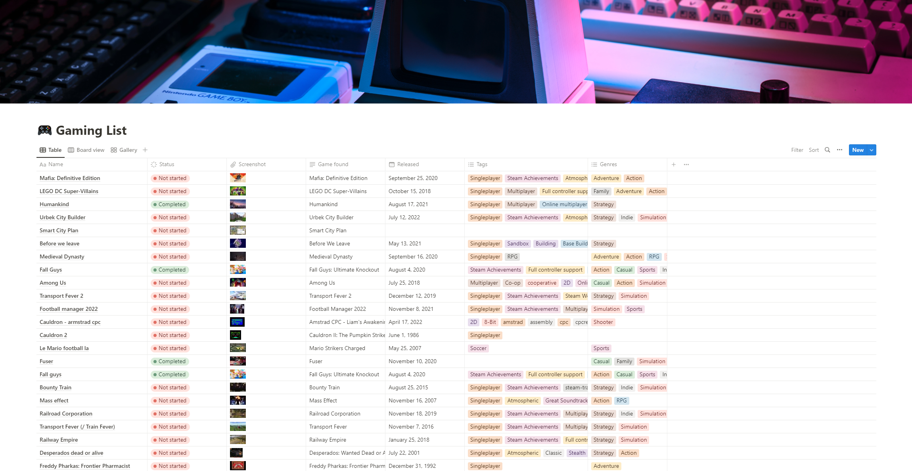

<!--  -->

# Notion-Games-Api

[](https://github.com/Mikaleb/Notion-Games-Api/blob/main/LICENSE.md) [](code_of_conduct.md)
[](https://snyk.io/test/github/Mikaleb/Notion-Games-Api) [](https://github.com/Mikaleb/Notion-Games-Api/issues)

 && 

This Notion integration syncs the daily Bing image of the day for a specific repo to a Notion Page

## Running the project locally

### 1. Setup your local project

```zsh
yarn
```

### 2. Set your environment variables in a `.env` file

You can create your own integration to get env variables here : https://www.notion.so/my-integrations


```zsh
NOTION_KEY=<your-notion-api-key>
NOTION_PAGE_ID=<notion-page-id>
```

You can create your Notion API key [here](www.notion.com/my-integrations).
Notion **api** [this way](https://developers.notion.com/reference/patch-page)
Rawg **api** [this way](https://api.rawg.io/docs/)

### 3. Run code

```zsh
yarn start
```

### 4. Make it daily with a Cron

```zsh
30 7 * * *
```

## FAQ

Please see [here](https://github.com/Mikaleb/Notion-Games-Api/wiki/FAQ) for a list of frequently asked questions.

## Licensing

See the [LICENSE](https://github.com/Mikaleb/Notion-Games-Api/blob/main/LICENSE.md) file for licensing information as it pertains to
files in this repository.

## Contribution

Notion-Games-Api is an open-source project and we are very happy to accept community contributions. Please refer to Contributing to [Notion-Games-Api page](https://github.com/Mikaleb/Notion-Games-Api/blob/main/CONTRIBUTING.md) for more details.

If you run into a bug or miss a feature, please [open an issue](https://github.com/Mikaleb/Notion-Games-Api/issues) in this repository.
